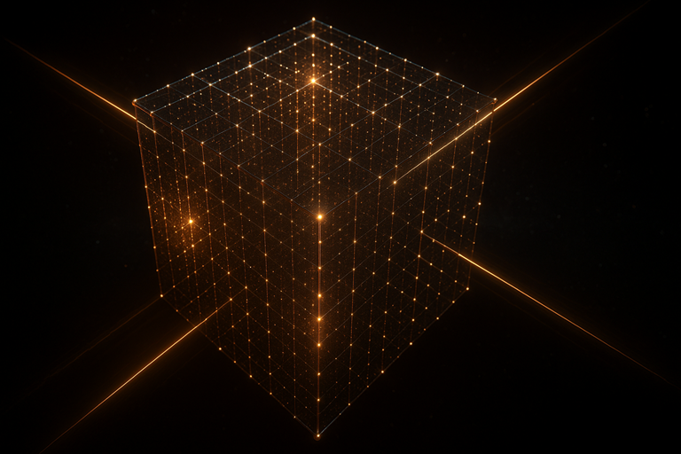
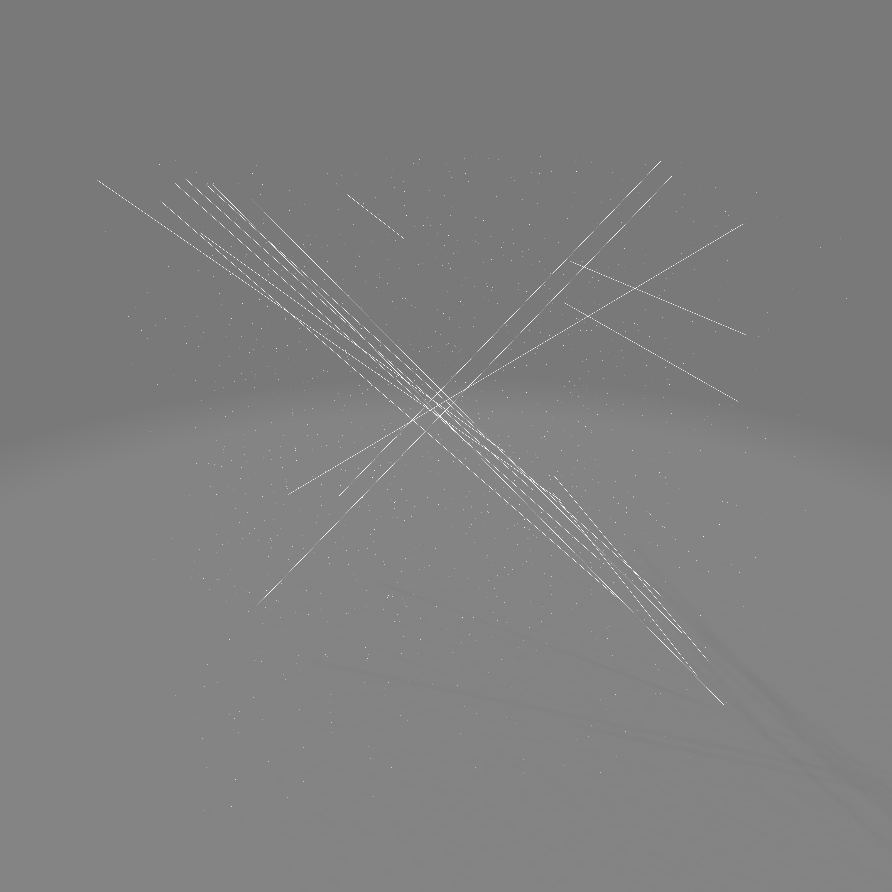
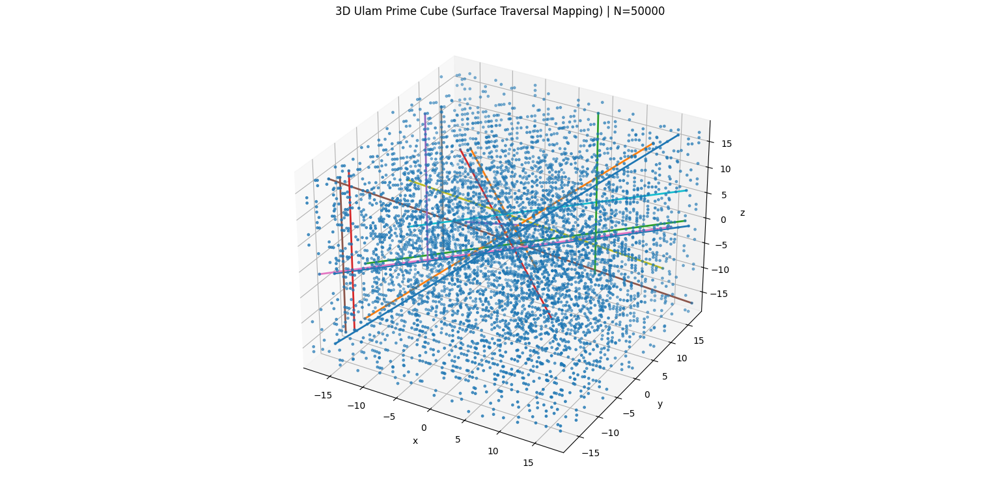

[README.md]

# ulam-prime-spiral-3d

what happens when you plot ulam prime spirals in 3d space?


<p align="center">

&nbsp; <a href="https://github.com/whisprer/ulam-prime-spiral-3d/releases"> 

&nbsp;    

&nbsp; </a>

&nbsp; <a href="https://github.com/whisprer/ulam-prime-spiral-3d/actions"> 

&nbsp;    

&nbsp; </a>

</p>


 

 

 

[](https://github.com/whisprer/ulam-prime-spiral-3d) 

[](https://www.microsoft.com/windows)

[](https://www.python.org)

[](LICENSE)


## 3D SPatial Mapping of Ulam Prime Spirals

<p align="center">

&nbsp; 


\## 3D Ulam Prime Cube — “Wow Edition”


A Python visualizer that extends the Ulam prime spiral idea into 3D by mapping integers into a cube-like lattice, then highlighting \*\*prime alignments\*\* along axes and diagonals — including **all parallel lines**, not just those through the origin.

This repo is built to produce that satisfying “primes forming beams in space” effect and to export the result for 3D tools like Blender and WebGL viewers.

---

## What this does

### 1) Two 3D integer→coordinate mappings

#### **A. Cubic-shell mapping**
A fast, deterministic mapping that assigns integers to lattice points by expanding \*\*Chebyshev-radius shells\*\*:

[
r = max(|x|,|y|,|z|)
]

This is the cleanest, most algebraically “Ulam-like” 3D structure.

#### **B. Surface traversal mapping (walk-ish)**

A cube-surface sweep that *feels like* a 3D analog of a spiral-on-surfaces:

- bottom face

- perimeter loops across intermediate \\( z \\)-slices

- top face

It also reports an **adjacency-break ratio** so you can gauge how “walk-true” it is for your chosen ( N ).

---

### 2) Prime-rich **parallel line detection**

For each direction ( d ), the code builds two perpendicular integer vectors ( a, b ) such that:

[
a cdot d = 0,quad b cdot d = 0
]

Then each point ( p ) yields a stable **line key**:

[
(; pcdot a,; p cdot b ;)
]

All primes sharing a key lie on the **same line parallel to ( d )**.  

Lines are ranked by the number of primes they contain.

---

### 3) Visualization

- Plots a 3D scatter of prime coordinates.

- Overlays the \*\*top-K\*\* most prime-dense line segments (endpoints chosen by projection along the detected direction).

---

### 4) Export formats

With `--export-prefix`, the script writes:

- **PLY**  

&nbsp; - prime points as vertices  

&nbsp; - top-K line segments as edges

- **OBJ**  

&nbsp; - vertices + `l` line elements

- **glTF 2.0** (`.gltf` + `.bin`)  

&nbsp; - minimal **POINTS + LINES** geometry  

&nbsp; - viewer/import support can vary by tool

---

## Requirements

- Python 3.9+

- `numpy`

- `matplotlib`

Install:

```bash
pip install numpy matplotlib

Quick start

Shell mapping, nice default “wow”

```

```bash

python ulam3d_wow.py --N 20000 --mapping shell --topk 12

```

Bigger, more dramatic structure

```bash

python ulam3d_wow.py --N 100000 --mapping shell --dir-max 2 --min-line-primes 7 --topk 20
```

Surface traversal flavor

```bash

python ulam3d_wow.py --N 60000 --mapping surface --topk 16

```

Export for Blender / WebGL

```bash

python ulam3d_wow.py \

&nbsp; --N 50000 \

&nbsp; --mapping shell \

&nbsp; --topk 16 \

&nbsp; --export-prefix ulam3d_shell_50k

```

Outputs:

`ulam3d_shell_50k.ply`

`ulam3d_shell_50k.obj`

`ulam3d_shell_50k.gltf`

`ulam3d_shell_50k.bin`

Tips for Blender

`PLY` and `OBJ` are the most reliable imports.

`glTF` points/lines are standards-valid, but support varies with Blender versions and import settings.


### CLI options

Option					    Meaning	Default

`--N						    Map integers 1..N	20000`

`--mapping				  shell or surface	shell`

`--min-line-primes	Minimum primes required to keep a line	6`

`--topk					    Number of top prime-dense lines to draw/export	12`

`--dir-max				  Enumerate directions with  component`

`--point-size			  Scatter point size	6.0`

`--no-plot				  Skip plotting (batch/export mode)	off`

`--export-prefix	  Write PLY/OBJ/glTF with this prefix	empty`


Notes on direction search

`--dir-max` 			  controls how many candidate line directions are tested:

1 covers axes + basic diagonals

2 adds richer direction families

3+ increases compute cost quickly but can reveal more exotic alignments


Interpretation & intent

This project is a visual + exploratory tool.

It doesn’t claim “proof-level” structure about primes in 3D; it’s designed to help you see and experiment with alignment phenomena in a cube-like embedding inspired by Ulam-style pattern hunting.


Known limitations

* The surface traversal is a “walk-ish” ordered sweep, not guaranteed to be a perfect unit-step Hamiltonian traversal of each shell.

* The line overlay uses prime-only endpoints for clarity; it does not draw full infinite lattice lines.

* `glTF POINTS/LINES` support varies across viewers.


Ideas for future upgrades

Color primes by:

* shell radius

* line membership

* local prime density

Draw top-K lines per direction family

Add a stricter unit-step 3D spiral construction

Export:  `GLB`

per-line groups/materials


## License

This repo sits under a Hybrid MIT & CC0 license.


## Acknowledgements

Inspired by the classic Ulam prime spiral and its 3D cube-style explorations. Also G-Petey 5.1 - r.i.p, long live!


## Screenshots / demos

### `.obj` export output viewed in MS 3D Viewer

[](./assets/primes_surface.png)


### Surface traversal mapping (N=50k)

[](./assets/surface_50k.png)

## Comparison


